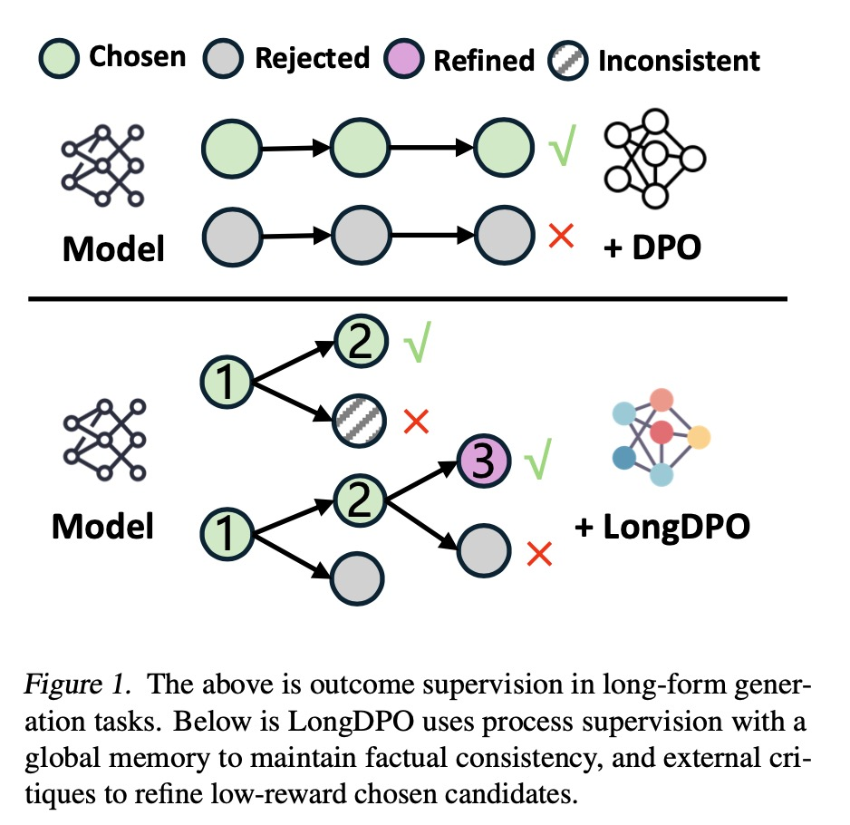
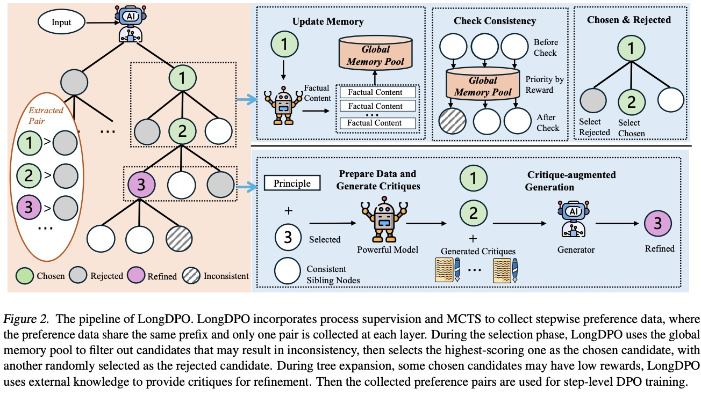

# LongDPO: Unlock Better Long-form Generation Abilities for LLMs via Critique-augmented Stepwise Information

The official repository containing the code for LongDPO. 



<p align="center">
  <a href="#-news">| 🔥 News</a> |
  <a href="#-quick-start">💡 Quick start</a> |
  <a href="#-method">🌈 Method</a> |
  <a href="#-experimental-results">🧪 Results |</a> |
  <a href="#-citation">📓 Citation</a> 
</p>

# 🔥 News
- Feb 2025: We release our code.

# 💡 Quick Start For Eval
## Install
```
conda create -n LongDPO python=3.10

conda activate LongDPO

pip install -r requirements.txt 
```
## Construct Data
We employ OpenR for construct stepwise data. 
```
See MCTS/ for more specific details.
```

## Training
We employ Xtuner for stepwise training. 
```
See llama3_8b_instruct_dpo.py 
```

## Eval
We employ vllm for evaluation
```
See vllm_inference.py 
```

# 🌈 Method
We propose LongDPO, which differs from traditional outcome supervision by adopting process supervision. LongDPO enables step-wise, more fine-grained learning for long-form text generation. 



# 🧪 Experimental Results
We validate that our method enhances performance in long-form generation tasks while maintaining near-lossless results for general tasks.
| Models | [0, 500)    | [0, 500)  | [500, 2k)    | [500, 2k)  | [2k, 4k)    |  [2k, 4k)   | [4k, 20k)   | [4k, 20k)   | Average     |  Average   |
|--------|-------------|------------|-------------|------------|-------------|------------|-------------|------------|-------------|------------|
|        Models        | $S_l$       | $S_q$      | $S_l$       | $S_q$      | $S_l$       | $S_q$      | $S_l$       | $S_q$      | $S_l$       | $S_q$      |
| **LongWriter-Llama**  | 88.10       | 86.00      | 74.50       | 86.90      | 89.10       | 88.30      | 80.80       | 79.20      | 83.12       | 85.10      |
| \*w/ DPO             | **90.93**   | 85.78      | 76.67       | 85.46      | 90.01       | 90.53      | 81.07       | 80.90      | 85.55       | 85.66      |
| \*w/ LongDPO         | 90.68       | **86.27**  | **77.23**   | **91.25**  | **93.35**   | **90.53**  | **88.25**   | **85.06**  | **87.38**   | **88.28**  |
| **LongWriter-Qwen**  | **90.80**   | 87.99      | 84.37       | 89.37      | 84.21       | 84.84      | 58.69       | 78.13      | 79.51       | 85.08      |
| \*w/ DPO             | 86.32       | 88.23      | **88.71**   | 89.16      | **89.28**   | 84.09      | 60.89       | 78.82      | 81.30       | 85.07      |
| \*w/ LongDPO         | 88.93       | **91.91**  | 85.47       | **91.25**  | 88.63       | **85.60**  | **71.14**   | **85.41**  | **83.54**   | **88.54**  |


|      | CR     | STC1   | STC2   | CR     | STC1   | STC2   | ACC     | ACC     | ACC     | ACC     |
|----------------------|--------|--------|--------|--------|--------|--------|---------|---------|---------|---------|
| **LongWriter-Llama**  | 46.00  | 22.60  | 9.80   | 34.50  | **33.60** | 10.00  | 38.43   | 56.07   | 63.24   | 57.70   |
| *w/ DPO*             | 64.99  | 25.99  | 16.29  | 65.24  | 32.47  | 20.39  | 38.17   | 55.68   | 63.30   | 59.20   |
| *w/ LongDPO*         | **69.38** | **27.59** | **18.45** | **66.96** | 32.63 | **20.83** | **40.76** | **58.78** | **63.67** | **61.30** |
| **LongWriter-Qwen**  | **98.94** | 31.39 | 31.02 | 58.67  | **33.58** | 18.93  | **45.29** | 61.78   | 74.16   | 83.78   |
| *w/ DPO*             | 95.95  | 31.18  | 29.83  | 82.23  | 29.02  | 22.33  | 39.29   | 57.67   | 63.67   | 83.85   |
| *w/ LongDPO*         | 98.51  | **33.07** | **32.52** | **84.95** | 29.86 | **24.32** | 44.92   | **62.75** | **74.25** | **84.08** |


# 📓 Citation
If you find our repo is helpful, please cite the following 
```bibtex
@misc{ping2025longdpounlockbetterlongform,
      title={LongDPO: Unlock Better Long-form Generation Abilities for LLMs via Critique-augmented Stepwise Information}, 
      author={Bowen Ping and Jiali Zeng and Fandong Meng and Shuo Wang and Jie Zhou and Shanghang Zhang},
      year={2025},
      eprint={2502.02095},
      archivePrefix={arXiv},
      primaryClass={cs.CL},
      url={https://arxiv.org/abs/2502.02095}, 
}
```